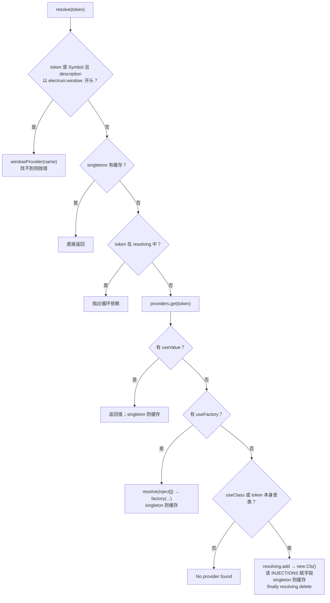

# 模块扫描与依赖注入

对应源码：

- `packages/core/src/module/scanner.ts` — 详细设计见 [ModuleScanner 设计说明](./module-scanner.md)
- `packages/core/src/di/container.ts`

## 1. ModuleScanner：把模块树变成「已注册表」

### 输入 / 输出

- **输入**：根 `AppModule` 类（必须有 `@Module`）
- **输出**：`ScannedModule[]`，且副作用：所有 Provider/Controller 已 `container.register(...)`

```ts
export interface ScannedModule {
  moduleClass: Function
  metadata: ModuleMetadata
  controllers: Function[]
  providers: Function[]      // 类 Provider 列表（含 useClass）
  declarations: Function[]   // 窗口声明类
}
```

### walk 算法（DFS）

```
walk(M):
  if visited(M): return
  mark visited
  meta = readMetadata(M, META.MODULE)   // 没有就抛错
  for imp in meta.imports: walk(imp)      // 先子模块
  注册 meta.providers
  注册 meta.controllers（useClass = 自身）
  results.push(ScannedModule)
```

要点：

1. **先 imports 再自己**：导入模块的 Provider 先入容器。  
2. **visited**：避免循环 import 死递归。  
3. Provider 形态支持四种（与 Nest 类似）：

| 写法 | 注册行为 |
|------|----------|
| `FooService`（函数/类） | `useClass: FooService`，scope 来自 `@Injectable` |
| `{ provide, useValue }` | 直接用值 |
| `{ provide, useClass }` | 别名/替换实现 |
| `{ provide, useFactory, inject }` | 工厂，先 resolve inject 列表 |

> Provider 一律注册进**同一个**全局 `DIContainer`，注册后任意模块均可 `@Inject`（无 Nest 式 exports 边界）。

## 2. DIContainer：`resolve` 全流程

源码：`packages/core/src/di/container.ts` → `resolve(token)`。

Stage 3 装饰器没有参数装饰器 / `design:paramtypes`，所以 **不用构造函数注入**。  
装饰器（`@Inject` / `@WindowRef` / `@Optional` / `@IpcEmit`）只往 `META.INJECTIONS` 写 `InjectionPoint`；**赋值全在 `resolve`**。

### 2.1 Token 类型

```ts
type Token = Function | string | symbol
```

| Token | 典型来源 |
|-------|----------|
| 类（`Function`） | `@Inject(FileService)`、模块 `providers` / `controllers` |
| `string` / `symbol` | `@Inject('APP_CONFIG')` 等自定义 token |
| `Symbol.for('electrum:window:…')` | `@WindowRef` 写入的窗口 token（见下） |

### 2.2 分支顺序（与源码一致）



文字版对照：

```
resolve(token)
  ① Symbol 窗口捷径（源码约 58–66 行）
       description 以 "electrum:window:" 开头
       → windowProvider(windowName)，不查 providers
  ② singleton 缓存命中 → 返回
  ③ resolving 已含 token → 环依赖错误（附解析链）
  ④ providers 记录：
       useValue  → 返回（可缓存）
       useFactory → 先 resolve(inject[])，再调工厂（可缓存）
  ⑤ 类实例化路径：
       new TargetClass()          // 无参
       读 META.INJECTIONS，按 type 赋字段（见 2.3）
       singleton → singletons.set
       finally → resolving.delete
```

### 2.3 字段注入（`META.INJECTIONS`）

`new` 之后遍历 `InjectionPoint[]`：

| `type` | 行为 |
|--------|------|
| `window` | `windowProvider(windowName)` 赋到字段；窗不存在抛错 |
| `emit` | 生成 `(...args) => windowSender(target, fullChannel, ...args)`；`fullChannel` 拼 Controller `prefix`；`target` = emitWindow → Controller.window → `'main'` |
| `optional` | `has(token)` 才 `resolve` 并赋值，否则跳过 |
| `service`（默认） | `resolve(injection.token)` 赋到字段 |

对应业务：

```ts
@Controller({ prefix: 'file', window: 'main' })
class FileController {
  @Inject(FileService)
  file!: FileService

  @WindowRef('main')
  mainWin!: BrowserWindow

  @IpcEmit('saved')
  notifySaved!: (path: string) => void
}
```

IpcBridge / Lifecycle 里 `container.resolve(Controller)` 时，上述字段才会被填上。

### 2.4 窗口 Token（`resolve` 开头特判）

`@WindowRef('main')` 写入的注入点 `type: 'window'`，走的是上表 `window` 分支（用 `windowName`），**不一定**再调一次 `resolve(Symbol)`。

若有人直接：

```ts
container.resolve(Symbol.for('electrum:window:main'))
```

则命中 **① 窗口捷径**（你标注的 57–66 行）：

```ts
if (typeof token === 'symbol') {
  const tokenStr = token.description || ''
  if (tokenStr.startsWith('electrum:window:')) {
    const windowName = tokenStr.replace('electrum:window:', '')
    const win = this.windowProvider(windowName)
    if (!win) throw new Error(`Window "${windowName}" not found`)
    return win as T
  }
}
```

接线：`WindowManager.initialize` 里

```ts
this.container.setWindowProvider((name) => this.getWindow(name))
```

`@IpcEmit` 则依赖 `setWindowSender`（`Application.start` 在建窗后设置 → `sendTo` / `broadcast`）。

因此启动顺序必须是：**先创窗并 setWindowProvider / setWindowSender，再 resolve 依赖窗或 emit 的 Controller**。

## 3. Scope

| Scope | 行为 |
|-------|------|
| `singleton`（默认） | 首次 resolve 后进 `singletons` Map |
| `transient` | 每次 `new` + 注入，不缓存 |

来源：`@Injectable({ scope: 'transient' })`，由 Scanner 读出后传入 `register`。  
`useValue` / `useFactory` 同样看记录上的 `scope` 决定是否写入 `singletons`。

## 4. 调试建议

1. 在 `ModuleScanner.walk` 末尾打 `console.log(moduleClass.name, metadata)` 看树。  
2. 环依赖故意造 `A→B→A`，看报错里的链格式。  
3. 对照 `packages/core/src/__tests__/metadata.spec.ts`：元数据与 `@IpcEmit` 的 `windowSender` 调用。

下一篇：[IPC 桥接与中间件](./ipc-and-middleware.md)
