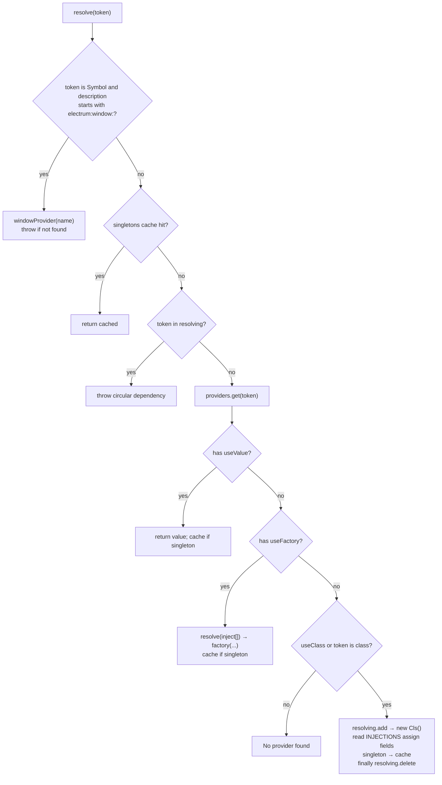

# Module Scan & Dependency Injection

Corresponding source:

- `packages/core/src/module/scanner.ts` — detailed design in [ModuleScanner design](./module-scanner.md)
- `packages/core/src/di/container.ts`

## 1. ModuleScanner: Module Tree → Registration Table

### Input / Output

- **Input**: Root `AppModule` class (must have `@Module`)
- **Output**: `ScannedModule[]`, with side effect: all Providers/Controllers already `container.register(...)`

```ts
export interface ScannedModule {
  moduleClass: Function
  metadata: ModuleMetadata
  controllers: Function[]
  providers: Function[]      // class Provider list (includes useClass)
  declarations: Function[]   // window declaration classes
}
```

### walk Algorithm (DFS)

```
walk(M):
  if visited(M): return
  mark visited
  meta = readMetadata(M, META.MODULE)   // throws if missing
  for imp in meta.imports: walk(imp)      // child modules first
  register meta.providers
  register meta.controllers (useClass = self)
  results.push(ScannedModule)
```

Key points:

1. **imports before self**: Imported module Providers enter the container first.  
2. **visited**: Avoid infinite recursion from circular imports.  
3. Four Provider shapes supported (similar to Nest):

| Form | Registration behavior |
|------|----------|
| `FooService` (function/class) | `useClass: FooService`, scope from `@Injectable` |
| `{ provide, useValue }` | Use value directly |
| `{ provide, useClass }` | Alias / swap implementation |
| `{ provide, useFactory, inject }` | Factory; resolve inject list first |

> All Providers register into **one** global `DIContainer`; after registration any module can `@Inject` them (no Nest-style exports boundary).

## 2. DIContainer: Full `resolve` Flow

Source: `packages/core/src/di/container.ts` → `resolve(token)`.

Stage 3 decorators have no parameter decorators / `design:paramtypes`, so **constructor injection is not used**.  
Decorators (`@Inject` / `@WindowRef` / `@Optional` / `@IpcEmit`) only write `InjectionPoint` to `META.INJECTIONS`; **assignment happens entirely in `resolve`**.

### 2.1 Token Types

```ts
type Token = Function | string | symbol
```

| Token | Typical source |
|-------|----------|
| Class (`Function`) | `@Inject(FileService)`, module `providers` / `controllers` |
| `string` / `symbol` | `@Inject('APP_CONFIG')` and other custom tokens |
| `Symbol.for('electrum:window:…')` | Window token written by `@WindowRef` (see below) |

### 2.2 Branch Order (matches source)



Text version:

```
resolve(token)
  ① Window shortcut for Symbols (source ~lines 58–66)
       description starts with "electrum:window:"
       → windowProvider(windowName), skip providers lookup
  ② singleton cache hit → return
  ③ token already in resolving → circular dependency error (with chain)
  ④ providers record:
       useValue  → return (may cache)
       useFactory → resolve(inject[]) first, then call factory (may cache)
  ⑤ Class instantiation path:
       new TargetClass()          // no-arg
       read META.INJECTIONS, assign fields by type (see 2.3)
       singleton → singletons.set
       finally → resolving.delete
```

### 2.3 Field Injection (`META.INJECTIONS`)

After `new`, iterate `InjectionPoint[]`:

| `type` | Behavior |
|--------|------|
| `window` | `windowProvider(windowName)` assigned to field; throw if window missing |
| `emit` | Build `(...args) => windowSender(target, fullChannel, ...args)`; `fullChannel` joins Controller `prefix`; `target` = emitWindow → Controller.window → `'main'` |
| `optional` | `resolve` and assign only if `has(token)`, otherwise skip |
| `service` (default) | `resolve(injection.token)` assigned to field |

Example in application code:

```ts
@Controller({ prefix: 'file', window: 'main' })
class FileController {
  @Inject(FileService)
  file!: FileService

  @WindowRef('main')
  mainWin!: BrowserWindow

  @IpcEmit('saved')
  notifySaved!: (path: string) => void
}
```

Fields are filled when IpcBridge / Lifecycle call `container.resolve(Controller)`.

### 2.4 Window Token (`resolve` Opening Special Case)

`@WindowRef('main')` writes an injection point with `type: 'window'`, using the `window` branch above (via `windowName`)—**not necessarily** another `resolve(Symbol)` call.

If someone directly calls:

```ts
container.resolve(Symbol.for('electrum:window:main'))
```

that hits **① window shortcut** (lines 57–66 you noted):

```ts
if (typeof token === 'symbol') {
  const tokenStr = token.description || ''
  if (tokenStr.startsWith('electrum:window:')) {
    const windowName = tokenStr.replace('electrum:window:', '')
    const win = this.windowProvider(windowName)
    if (!win) throw new Error(`Window "${windowName}" not found`)
    return win as T
  }
}
```

Wiring: in `WindowManager.initialize`

```ts
this.container.setWindowProvider((name) => this.getWindow(name))
```

`@IpcEmit` depends on `setWindowSender` (`Application.start` sets it after window creation → `sendTo` / `broadcast`).

Therefore startup order must be: **create windows and setWindowProvider / setWindowSender first, then resolve Controllers that depend on windows or emit**.

## 3. Scope

| Scope | Behavior |
|-------|------|
| `singleton` (default) | First resolve stored in `singletons` Map |
| `transient` | `new` + inject every time, no cache |

Source: `@Injectable({ scope: 'transient' })`, read by Scanner and passed to `register`.  
`useValue` / `useFactory` also respect `scope` on the record when deciding whether to write `singletons`.

## 4. Debugging Tips

1. At the end of `ModuleScanner.walk`, log `console.log(moduleClass.name, metadata)` to inspect the tree.  
2. Deliberately create circular dependency `A→B→A` and check the chain format in the error.  
3. Compare with `packages/core/src/__tests__/metadata.spec.ts`: metadata and `@IpcEmit` `windowSender` calls.

Next: [IPC bridge & middleware](./ipc-and-middleware.md)
